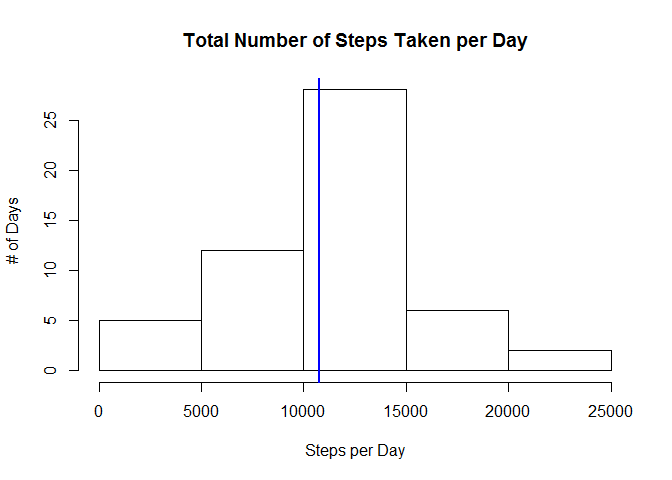
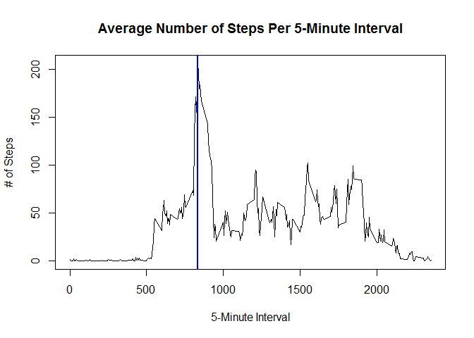
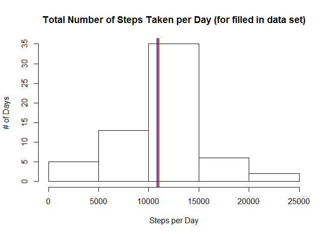
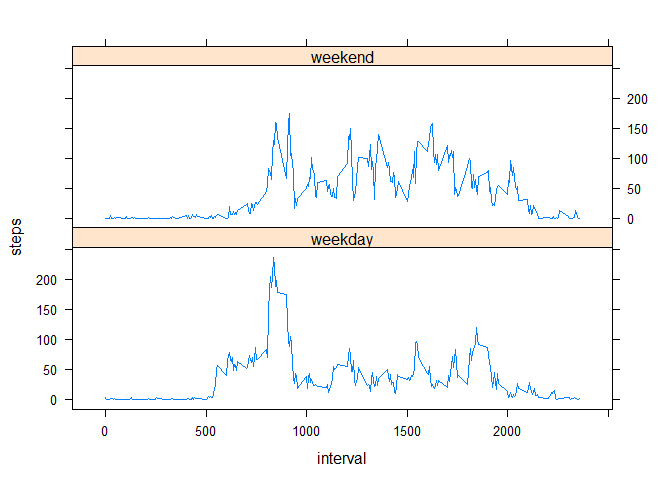

# Reproducible Research: Peer Assessment 1
Chuck Thompson  
Sunday, January 18, 2015  

## Setting up R Environment


```r
# Turn echo on globally as instructed in the course assignment.
knitr::opts_chunk$set(echo = TRUE)

# And load packages that will be used later on.
library(dplyr, warn.conflicts = FALSE)
library(chron)
library(lattice)
```


## Loading and preprocessing the data


```r
# The data for this assignment is available at:
#  https://d396qusza40orc.cloudfront.net/repdata%2Fdata%2Factivity.zip
#
# However, we use the copy of it included in the forked GitHub repo
# we started with as instructed in the project assignment.

dataZIPFile <- "activity.zip"
dataFile <- "activity.csv"

# If the extracted data file is not already available, download it.
if (!file.exists(dataFile)) {
    unzip (dataZIPFile, dataFile)  # extract data file from the ZIP
}

# Now read in the CSV file
data <- read.csv(dataFile)

# Add a variable indicating the day of the week of each observation
data <- mutate(data, weekday = weekdays(as.Date(date)))

# Normally this would be where we would also add a factor variable indicating
# whether the day of the week of the observation was a weekday or weekend.
# This is done later on, however, at the point in the assignment where it is
# asked for.

# Create two variants of the data for later use, 1) without observations with
# missing values and 2) with only those observations with missing values.
dataWithMissing <- data[which(is.na(data$steps)),]
dataWithoutMissing <- data[which(!is.na(data$steps)),]
```


## What is mean total number of steps taken per day?

For this part of the assignment, the missing values in the data set are ignored.


```r
# Create a summary of the data set with the total number of steps for each
# day, ignoring any missing values.
dataStepsDay <- summarize(group_by(dataWithoutMissing, date),
                                  steps = sum(steps))
dataStepsDayMean <- mean(dataStepsDay$steps)    # calc mean steps per day
dataStepsDayMedian <- median(dataStepsDay$steps)    # calc median steps per day

# This is created as a function so that it can also be used with a revised
# data set that will be generated later.
histPlotSteps <- function (histData, histMean, histMedian, histTitle) {
    par(mfrow=c(1,1))   # Make certain we only have a single plot.
    hist(histData$steps, xlab="Steps per Day", ylab="# of Days",
        main=histTitle)
    abline(v = histMedian, col="red", lwd=2)    # add line where median is
    abline(v = histMean, col="blue", lwd=2)     # add line where mean is
}

# Create a histogram showing the number of steps taken each day.
histPlotSteps(dataStepsDay, dataStepsDayMean, dataStepsDayMedian,
              "Total Number of Steps Taken per Day")
```

 

The mean number of steps per day was 10766.19 and
the median number of steps per day was 10765.00.
The blue line on the histogram represents the mean.  Because these values
are so close to the same, a separate red line indicating the median is
covered up by the blue line representing the mean.


## What is the average daily activity pattern?

For this part of the assignment, the missing values in the data set are 
still ignored.


```r
# Create a summary of the data set with the total number of steps for each
# interval, ignoring any missing values.
dataStepsInterval <- summarize(group_by(dataWithoutMissing, interval),
                               steps = mean(steps))
dataStepsMaxInterval <- 
    dataStepsInterval[which(dataStepsInterval$steps==max(dataStepsInterval$steps)),]$interval

par(mfrow=c(1,1))   # Make certain we only have a single plot.
plot(dataStepsInterval$interval, dataStepsInterval$steps, type="l",
     xlab="5-Minute Interval", ylab="# of Steps",
     main="Average Number of Steps Per 5-Minute Interval")
abline(v = dataStepsMaxInterval, col="blue", lwd=2) # add line where max val is
```

 

The 5-minute interval 835 contains the maximum number of
steps among all intervals in the data set.  It is represented on the plot by
the blue line.


## Imputing missing values

### Missing Values Exploratory Data Analysis


```r
# total number of days with observations
totalDates <- length(unique(data$date))

# total number of days with observations with missing values
totalDatesWithMissing <- length(unique(dataWithMissing$date))

print (sprintf("%d days out of %d total have NA values",
    totalDatesWithMissing, totalDates))
```

```
## [1] "8 days out of 61 total have NA values"
```

```r
# Output how many intervals in each day with missing values are missing values.
# Note that there are 288 intervals per day (24 hours * 60 mins. / 5 mins.)
for (date in unique(dataWithMissing$date)) {
    missingInt <- nrow(dataWithMissing[which(dataWithMissing$date==date),])
    print(sprintf("%s has %d NA values", date, missingInt))
}
```

```
## [1] "2012-10-01 has 288 NA values"
## [1] "2012-10-08 has 288 NA values"
## [1] "2012-11-01 has 288 NA values"
## [1] "2012-11-04 has 288 NA values"
## [1] "2012-11-09 has 288 NA values"
## [1] "2012-11-10 has 288 NA values"
## [1] "2012-11-14 has 288 NA values"
## [1] "2012-11-30 has 288 NA values"
```

There are 2304 total missing values in the data set.

Only 8 out of 61 days have NA values for step
counts for any of their intervals.  For each of these, every interval has NA
for the step count.  This means that it will not work to extrapolate missing
interval data using other data within the same day.


### Missing Values Calculation Strategy

Based on the exploratory data analysis, I decided to fill in missing values
using the mean of all non-missing values for the given interval for all same
days of the week.  For example, if interval 565 is missing for a Sunday, I
set its value to be the mean for interval 565 for all other Sunday's present
in the data set.  This is based on an assumption that the person's activities
are most similar on same days of the week (e.g. going to work first thing
on Monday mornings).


```r
#
# This is an expensive calculation so cache it to speed up future knits.
#

completeData <- data    # Initialize the new data set with the original one.

for (elt in 1:nrow(completeData)) {     # for each element in the data set
    if (is.na(completeData[elt,"steps"])) {     # if steps is missing
        eltDoW <- completeData[elt,"weekday"]
        eltInt <- completeData[elt,"interval"]
        
        # Calculate the mean for this interval for all other same days of the
        # week in the original data set.  The original data set is used for
        # this calculation so that already replaced missing values in the new
        # data set are not included in the calculation.
        newSteps <- mean(data[which(data$weekday==eltDoW &
                                   data$interval==eltInt &
                                   !is.na(data$steps)),]$steps)
        
        # Set the missing value to the ceiling of the calculated mean since
        # steps is intended as a discrete variable (i.e. it does not record
        # partial steps).
        completeData[elt,"steps"] <- ceiling(newSteps)
    }
}
```

The variable `completeData` is now equal to the original dataset but with the
missing data filled in.


### Revised Mean and Median Total Number of Steps Per Day


```r
# Create a summary of the data set with the total number of steps for each
# day, this time with the revised data set that has missing values filled in.
completeDataStepsDay <- summarize(group_by(completeData, date),
                                  steps = sum(steps))
completeDataStepsDayMean <- mean(completeDataStepsDay$steps)    # calc mean
completeDataStepsDayMedian <- median(completeDataStepsDay$steps) # calc median

# Create a histogram showing the number of steps taken each day based on
# the revised data set.
histPlotSteps(completeDataStepsDay, completeDataStepsDayMean,
                completeDataStepsDayMedian,
                "Total Number of Steps Taken per Day (for filled in data set)")
```

 

With the missing values filled in, the mean number of steps per day is now
10832.66 and the median number of steps
per day is now 11015.00.  Adding in the
missing values has increased the total daily number of steps with corresponding
increases in the mean and median number of steps per day of 
66.47 and
250 respectively.

Filling in the missing values caused the mean and median to move further apart,
allowing the red line representing the median on the histogram to now be seen
separately from the blue line representing the mean.


## Are there differences in activity patterns between weekdays and weekends?

```r
#
# This is an expensive calculation so we cache it to speed up future knits.
# The xyplot cannot be cached so it is included in a separate code block
# immediately after this one.
#

# This function checks what day of the week a given date was and returns a
# factor variable indicating if it is a "weekday" or a "weekend" day.
typeofday_check <- function (date) {
    if (is.weekend(date)) {
        return (as.factor("weekend"))
    } else {
        return (as.factor("weekday"))
    }
}

# Add a new column for the variable "typeofday" to our complete data set.
# This would normally have been done in the "Load and Clean Data" section but
# is done here as it is where the instruction to do so is specified in the
# assignment.
completeData <- cbind(completeData,
                      typeofday = sapply(completeData$date,typeofday_check))

# We need to recreate this variable now to take into account the just added
# typeofday variable column.
completeDataStepsDay <- summarize(group_by(completeData, interval, typeofday),
                           steps = mean(steps))
```

The `completeData` dataset now has an additional column named `typeofday` that
specifies whether each observation was taken on a weekday or a weekend.


```r
# Create a panel plot showing the average number of steps take in each 
# 5-minute interval across all weekdays and across all weekend days.
xyplot(steps ~ interval | typeofday, completeDataStepsDay,
       layout=c(1,2), type="l")
```

 

This plot shows that the step activity started occuring earlier in the day, on
average, on weekdays than on weekends but continued later into the day on
weekends.  The highest peek activity occurs on weekdays during roughly the 700
to 900 intervals but weekends show a higher sustained level of steps activity.
